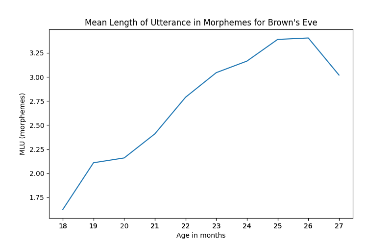

.. _quickstart:

Quickstart
==========

After you have downloaded and installed PyLangAcq (see :ref:`download_install`),
import the package ``pylangacq`` in your Python interpreter:

.. code-block:: python

    import pylangacq

No errors? Great! Now you're ready to proceed.

Reading CHAT data
-----------------

First off, we need some CHAT data to work with.
As the CHAT data format is primarily associated with the TalkBank and CHILDES
ecosystem,
it is natural to use one of the available datasets.
A classic dataset is `Brown <https://childes.talkbank.org/access/Eng-NA/Brown.html>`_
for American English from CHILDES.
On this webpage, after you've logged in (account setup is free),
you should be able to download the full transcripts of CHAT data as a ZIP archive to your local drive.
:func:`~pylangacq.read_chat` can read this ZIP archive directly:

.. code-block:: python

    brown = pylangacq.read_chat("path/to/your/local/Brown.zip")
    brown.n_files
    # 214
    brown.file_paths
    # ['Brown/Adam/020304.cha',
    #  'Brown/Adam/020318.cha',
    #  ...
    #  'Brown/Eve/010600a.cha',
    #  'Brown/Eve/010600b.cha',
    #  ...
    #  'Brown/Sarah/020305.cha',
    #  'Brown/Sarah/020307.cha',
    #  ...]

Brown has 214 ``.cha`` data files.
They are organized in subdirectories for the three children of Adam, Eve, and Sarah.
``brown`` is a :class:`~pylangacq.CHAT` instance that represents the Brown data
and provides various methods.
But before we get into those, let's filter the data down to one of the children,
so that we aren't producing unwanted results with all children's data mixed up down the road.
With ``brown`` in hand, we can filter based on knowledge of the file paths,
targeting those that contain the string ``"Eve"``:

.. code-block:: python

    eve = brown.filter(files="Eve")
    eve.n_files
    # 20
    eve.file_paths
    # ['Brown/Eve/010600a.cha',
    #  'Brown/Eve/010600b.cha',
    #  'Brown/Eve/010700a.cha',
    #  ...]

``eve`` is also a :class:`~pylangacq.CHAT` instance, but with only 20 data files.
Let's check out some of the data access methods below.

More on :ref:`read`.

Header Information
------------------

CHAT transcript files store metadata in the header with lines beginning with ``@``.
Among other things, ``eve`` has the age information of Eve when the recordings were made,
which is from 1 year and 6 months old to 2 years and 3 months old:

.. code-block:: python

    eve.ages()
    # [Age('1;06.00'),
    #  Age('1;06.00'),
    #  Age('1;07.00'),
    #  Age('1;07.00'),
    #  Age('1;08.00'),
    #  Age('1;09.00'),
    #  Age('1;09.00'),
    #  Age('1;09.00'),
    #  Age('1;10.00'),
    #  Age('1;10.00'),
    #  Age('1;11.00'),
    #  Age('1;11.00'),
    #  Age('2;00.00'),
    #  Age('2;00.00'),
    #  Age('2;01.00'),
    #  Age('2;01.00'),
    #  Age('2;02.00'),
    #  Age('2;02.00'),
    #  Age('2;03.00'),
    #  Age('2;03.00')]

More on :ref:`headers`.

Transcriptions and Annotations
------------------------------

:meth:`~pylangacq.CHAT.words` is one of the methods to access the transcriptions:

.. code-block:: python

    words = eve.words()  # list of strings, for all the words across all 20 files
    len(words)  # total word count
    # 120317
    words[:8]
    # ['more', 'cookie', '.', 'you', 'more', 'cookies', '?', 'how_about']

By default, :meth:`~pylangacq.CHAT.words`
returns a flat list of results from all the files.
If we are interested in the results for individual files,
the method has the optional boolean parameter ``by_files``:

.. code-block:: python

    words_by_files = eve.words(by_file=True)  # list of lists of strings, each inner list for one file
    len(words_by_files)  # expects 20 -- that's the number of files of ``eve``
    # 20
    for words_one_file in words_by_files:
        print(len(words_one_file))

    # 5833
    # 5272
    # 2500
    # 5765
    # 5742
    # 4355
    # 5352
    # 8934
    # 4474
    # 4573
    # 4207
    # 6218
    # 4459
    # 5240
    # 8109
    # 7378
    # 10910
    # 8427
    # 6931
    # 5638

Apart from transcriptions, CHAT data has rich annotations for linguistic
and extra-linguistic information.
Specifically, many CHAT datasets on CHILDES have the ``%mor`` and ``%gra`` tiers
for morphological information and grammatical relations, respectively.
A CHAT data object such as ``eve`` from above has all this information readily available
to you via :meth:`~pylangacq.CHAT.tokens`
-- think of :meth:`~pylangacq.CHAT.tokens`
as :meth:`~pylangacq.CHAT.words` with annotations:

.. code-block:: python

    some_tokens = eve.tokens()[:5]
    some_tokens
    # [Token(word='more', pos='adj', mor='more-Cmp-S1', gra=Gra(dep=1, head=2, rel='AMOD')),
    #  Token(word='cookie', pos='noun', mor='cookie', gra=Gra(dep=2, head=2, rel='ROOT')),
    #  Token(word='.', pos='', mor='.', gra=Gra(dep=3, head=2, rel='PUNCT')),
    #  Token(word='you', pos='pron', mor='you-Prs-Acc-S2', gra=Gra(dep=1, head=3, rel='NSUBJ')),
    #  Token(word='more', pos='adj', mor='more-Cmp-S1', gra=Gra(dep=2, head=3, rel='AMOD'))]

    # The Token class is a dataclass. A Token instance has attributes as shown above.
    for token in some_tokens:
        print(token.word, token.pos)

    # more adj
    # cookie noun
    # .
    # you pron
    # more adj

Beyond the ``%mor`` and ``%gra`` tiers,
an utterance has yet more information from the original CHAT data file.
If you need information such as the unsegmented transcription, time marks,
or any unparsed tiers, :meth:`~pylangacq.CHAT.utterances` is what you need:

.. code-block:: python

    utterance = eve.utterances()[0]
    utterance
    # Utterance(participant='CHI', tokens=[...3 tokens], time_marks=None)
    utterance.tiers  # original, unparsed tiers for annotations etc.
    # {'CHI': 'more cookie . [+ IMP]',
    #  '%gra': '1|2|AMOD 2|2|ROOT 3|2|PUNCT',
    #  '%mor': 'adj|more-Cmp-S1 noun|cookie .',
    #  '%int': 'distinctive , loud'}

As we've started digging into the data, it would be helpful to distinguish
the child speech (i.e., participant = "CHI") versus child-directed speech.
Use :meth:`~pylangacq.CHAT.filter` to filter ``eve`` down to the desired subset
of the data:

.. code-block:: python

    eve_chi = eve.filter(participants="CHI")  # child speech
    eve_chi.utterances()[:5]
    # [Utterance(participant='CHI', tokens=[...3 tokens], time_marks=None),
    #  Utterance(participant='CHI', tokens=[...3 tokens], time_marks=None),
    #  Utterance(participant='CHI', tokens=[...3 tokens], time_marks=None),
    #  Utterance(participant='CHI', tokens=[...2 tokens], time_marks=None),
    #  Utterance(participant='CHI', tokens=[...2 tokens], time_marks=None)]

    eve_cds = eve.filter(participants="^(?!CHI$)")  # child-directed speech, regex ^(?!CHI$) for "not CHI"
    eve_cds.utterances()[:5]
    # [Utterance(participant='MOT', tokens=[...4 tokens], time_marks=None),
    #  Utterance(participant='MOT', tokens=[...5 tokens], time_marks=None),
    #  Utterance(participant='MOT', tokens=[...7 tokens], time_marks=None),
    #  Utterance(participant='MOT', tokens=[...2 tokens], time_marks=None),
    #  Utterance(participant='MOT', tokens=[...4 tokens], time_marks=None)]

More on :ref:`transcriptions`.

Word Frequencies and Ngrams
---------------------------

For word combinatorics, check out :meth:`~pylangacq.CHAT.word_ngrams`.
A special case of general interest is word frequencies,
which are unigrams (ngrams with n = 1):

.. code-block:: python

    word_unigrams_chi = eve_chi.word_ngrams(1)
    type(word_unigrams_chi)
    # Ngrams  # stores ngrams efficiently, otherwise works like a collections.Counter
    word_counter_chi = word_unigrams_chi.to_counter()
    type(word_counter_chi)
    # collections.Counter  # https://docs.python.org/3/library/collections.html#collections.Counter
    word_counter_chi.most_common(10)
    # [(('.',), 10389),
    #  (('?',), 1449),
    #  (('I',), 1197),
    #  (('that',), 1047),
    #  (('a',), 883),
    #  (('it',), 799),
    #  (('Fraser',), 682),
    #  (('you',), 636),
    #  (('the',), 558),
    #  (('my',), 519)]

    word_counter_cds = eve_cds.word_ngrams(1).to_counter()
    word_counter_cds.most_common(10)
    # [(('.',), 9682),
    #  (('?',), 4909),
    #  (('you',), 3080),
    #  ((',',), 2090),
    #  (('the',), 1966),
    #  (('it',), 1565),
    #  (('what',), 1550),
    #  (('a',), 1324),
    #  (('I',), 899),
    #  (('is',), 894)]

Note that ngrams are represented as Python tuples, which is also true for unigrams
as shown. This short illustration already shows some of the characteristic differences
between child speech and child-directed speech, e.g., more questions and second-person
pronouns in child-directed speech than child speech.

To check out the top word bigrams:

.. code-block:: python

    eve_chi.word_ngrams(2).to_counter().most_common(5)
    # [(('it', '.'), 356),
    #  (('that', '?'), 326),
    #  (('yeah', '.'), 326),
    #  (('no', '.'), 296),
    #  (('there', '.'), 253)]

    eve_cds.word_ngrams(2).to_counter().most_common(5)
    # [(('what', '?'), 503),
    #  (('it', '.'), 347),
    #  (('on', 'the'), 327),
    #  (('are', 'you'), 308),
    #  (('in', 'the'), 301)]

More on :ref:`frequencies`.

Developmental Measures
----------------------

To get the mean length of utterance (MLU), use :meth:`~pylangacq.CHAT.mlum`:

.. code-block:: python

    eve_chi.mlum()  # mean length of utterance by morpheme
    # [1.43,
    #  1.82,
    #  2.15,
    #  2.07,
    #  2.16,
    #  2.4,
    #  2.43,
    #  2.4,
    #  2.86,
    #  2.72,
    #  2.69,
    #  3.4,
    #  3.5,
    #  2.83,
    #  3.54,
    #  3.24,
    #  3.61,
    #  3.2,
    #  3.8,
    #  2.24]

The result is the MLU in morphemes for each of Eve's CHAT files in order.
As this is a list of floats, they can be readily piped into
other packages for making plots, for example:

.. code-block:: python

    import pylangacq

    # matplotlib and seaborn required for this code snippet
    import matplotlib.pyplot as plt
    import seaborn as sns

    brown = pylangacq.read_chat("path/to/your/local/Brown.zip")
    eve = brown.filter(files="Eve")
    eve_chi = eve.filter(participants="CHI")
    ages_in_months = [age.in_months() if age else None for age in eve_chi.ages()]

    plt.figure(figsize=(8, 5))
    sns.lineplot(
        x=ages_in_months,
        y=eve_chi.mlum(),
        errorbar=None,
    )

    plt.title("Mean Length of Utterance in Morphemes for Brown's Eve")
    plt.xlabel("Age in months")
    plt.ylabel("MLU (morphemes)")
    plt.xticks(ages_in_months)

    plt.savefig("brown_eve_mlum.png")
    plt.close()

More on :ref:`measures`.

Questions?
----------

If you have any questions, comments, bug reports etc, please open `issues
at the GitHub repository <https://github.com/jacksonllee/pylangacq/issues>`_, or
contact `Jackson L. Lee <https://jacksonllee.com/>`_.
